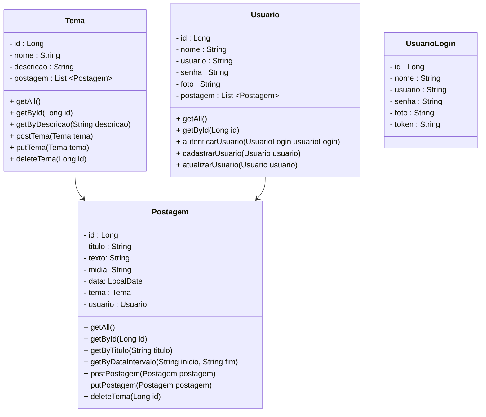

# Back-end 

<h2>Processo da implementação das camadas para a segurança, testes e o deploy<\h2>

- [x] Criei a Camada Model, repository, controler, service das Tabela Temas,Postagens,Usuario.
- [x] Criei a camada Usuario Login.
- [x] Editado o Pom.xml, com as dependências para a segurança do projeto e para o deploy.
- [x] Criei a Camada de Security,BasicSecurityConfig,UserDetailsServiceImpl,UserDetailsServiceImpl.
- [x] Crie as camadas controller e repository teste JUnit.
- [x] Configurado os application.properties e adicionado as applications Dev.properties e prod.properties na pasta src/main/resources para o deploy no heroku.
- [x] Criei a camada swaggerConfiguration para o deploy no heroku. 
- [x] Executei os testes no Insomnia tanto em Dev como em Prod.             

 
 

 
<h3 align="center">
DER: Modelo de Entidade-Relacionamento nessa Task:
  

